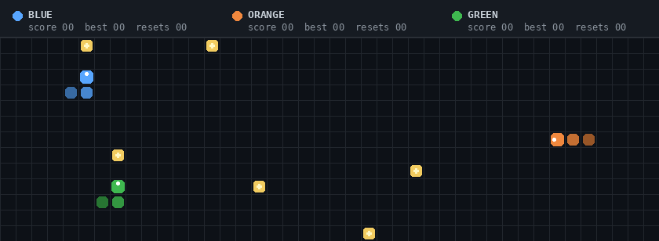

[](https://github.com/Dipesh600/Dipesh600/actions/workflows/update-readme.yml)

<p align="center">
  
</p>

<p align="center">
  <a href="mailto:dipesh@shuvmarg.com"></a>
  <a href="https://github.com/Dipesh600?tab=repositories"></a>
  <a href="https://github.com/Dipesh600/shuvmarg_passenger_web"></a>
</p>

<p align="center">
  <b>Product Engineer · Co-founder of Shuvmarg · Computer Science Undergraduate</b>
</p>

<p align="center">
  
</p>

<p align="center">
  <sub>Three autonomous players · real reward collection · body growth · collision detection · score reset · infinite loop</sub>
</p>

```yaml
name: Dipesh Chaudhary
role: Product Engineer and Co-founder
education: B.Tech in Computer Science, Lovely Professional University

currently_building:
  - Shuvmarg: Intercity bus technology for Nepal
  - Disha: AI-assisted visual explanation and animation

engineering_focus:
  - Product and system architecture
  - Full-stack web development
  - Android and offline-first applications
  - Applied AI and agentic workflows
  - Developer tools and integrations

journey:
  - "Started with Android and web development"
  - "Built marketplaces, automation tools and student products"
  - "Moved from isolated features to complete product systems"
  - "Now building around operational problems experienced in the real world"

community:
  - Coding Club, Lovely Professional University
  - Macbease organizer
  - CREAO Ambassador
```

## Featured work

<table>
  <tr>
    <td width="100%" valign="top">
      <sub><b>01 / TRANSPORTATION TECHNOLOGY</b></sub>
      <h2>Shuvmarg</h2>
      <p><b>A multi-sided operating platform for intercity bus travel in Nepal.</b></p>
      <p>Shuvmarg connects the passenger booking experience with the operational systems behind it: agents, bus operators, fleets, schedules, routes, stops, seat maps, payments, cancellations and field operations.</p>
      <p>My work covers product definition, system architecture and engineering across the platform—from modelling Nepal's real transport network to designing reliable workflows for environments with inconsistent connectivity.</p>
      <p>
        
        
        
        
      </p>
      <p><a href="https://github.com/Dipesh600/shuvmarg_passenger_web"><b>Passenger application ↗</b></a> · <a href="https://github.com/Dipesh600/shuvmarg_agent_web"><b>Agent application ↗</b></a> · <a href="https://github.com/Dipesh600/Shuvmarg-bus-booking-platform-backend"><b>Backend ↗</b></a></p>
      <table>
        <tr>
          <td width="33%"><b>Role</b><br /><sub>Co-founder · Product and Engineering</sub></td>
          <td width="33%"><b>Stage</b><br /><sub>Active development</sub></td>
          <td width="34%"><b>Focus</b><br /><sub>Product systems · Transport operations · Offline-first architecture</sub></td>
        </tr>
      </table>
    </td>
  </tr>
</table>

<table>
  <tr>
    <td width="50%" valign="top">
      <sub><b>02 / APPLIED AI</b></sub>
      <h3>Disha</h3>
      <p><b>AI-assisted visual explanation and whiteboard-animation pipeline.</b></p>
      <p>Disha turns an idea or recording into a structured visual story by coordinating scripting, narration, scene planning, visual direction, timing and rendering. The current work focuses on improving consistency while avoiding the slow SVG-heavy rendering approach used in earlier prototypes.</p>
      <p> </p>
      <p><a href="https://github.com/Dipesh600/Disha"><b>View project ↗</b></a></p>
    </td>
    <td width="50%" valign="top">
      <sub><b>03 / DEVELOPER TOOLING</b></sub>
      <h3>eSewa MCP Server</h3>
      <p><b>Connecting Nepal-specific payment services with agentic software.</b></p>
      <p>An open-source Model Context Protocol server that exposes eSewa payment capabilities to AI agents and MCP-compatible development environments through reusable interfaces.</p>
      <p>  </p>
      <p><a href="https://github.com/Dipesh600/esewa-mcp-server"><b>View project ↗</b></a></p>
    </td>
  </tr>
</table>

## Technical background

<p align="center">
  
</p>

| Area | Experience |
| --- | --- |
| Product engineering | Requirements, workflows, system design, prototyping and product iteration |
| Frontend | React, Next.js, Vue, TypeScript, Tailwind CSS and component systems |
| Backend | Node.js, Express, Django, REST APIs and authentication systems |
| Mobile | Android, Kotlin, Room, SQLite and offline-first design |
| Data | MongoDB, PostgreSQL, Supabase and Firebase |
| AI and automation | OpenAI APIs, LLM workflows, MCP, dataset design and media-generation pipelines |

## GitHub overview

<p align="center">
  
</p>

<p align="center">
  
  
  
</p>

## Leadership and community

- Contribute to the **Coding Club at Lovely Professional University**, a technical community with more than 1,000 registered students.
- Helped organize **Macbease** and other student-focused technology events.
- Work as a **CREAO Ambassador**, supporting developer and AI community initiatives.
- Won a **MiniMax Agent Hackathon** award.

## Recent activity

<!--START_SECTION:activity-->
1. ❌ Closed PR [#36](https://github.com/Dipesh600/Shuvmarg-bus-booking-platform-backend/pull/36) in [Dipesh600/Shuvmarg-bus-booking-platform-backend](https://github.com/Dipesh600/Shuvmarg-bus-booking-platform-backend)
<!--END_SECTION:activity-->

---

<table>
  <tr>
    <td width="62%" valign="top">
      <h2>Building useful systems.</h2>
      <p>I am interested in product engineering work that connects software with real operational problems—especially transportation, digital infrastructure, developer tooling and applied AI.</p>
      <p><b>Currently:</b> building Shuvmarg and developing Disha for the OpenAI hackathon.</p>
    </td>
    <td width="38%" valign="top">
      <h3>Connect</h3>
      <p><a href="mailto:dipesh@shuvmarg.com"><b>dipesh@shuvmarg.com</b></a></p>
      <p><a href="https://github.com/Dipesh600">GitHub profile ↗</a><br />
      <a href="https://github.com/Dipesh600?tab=repositories">All repositories ↗</a></p>
    </td>
  </tr>
</table>

<p align="center">
  
</p>
